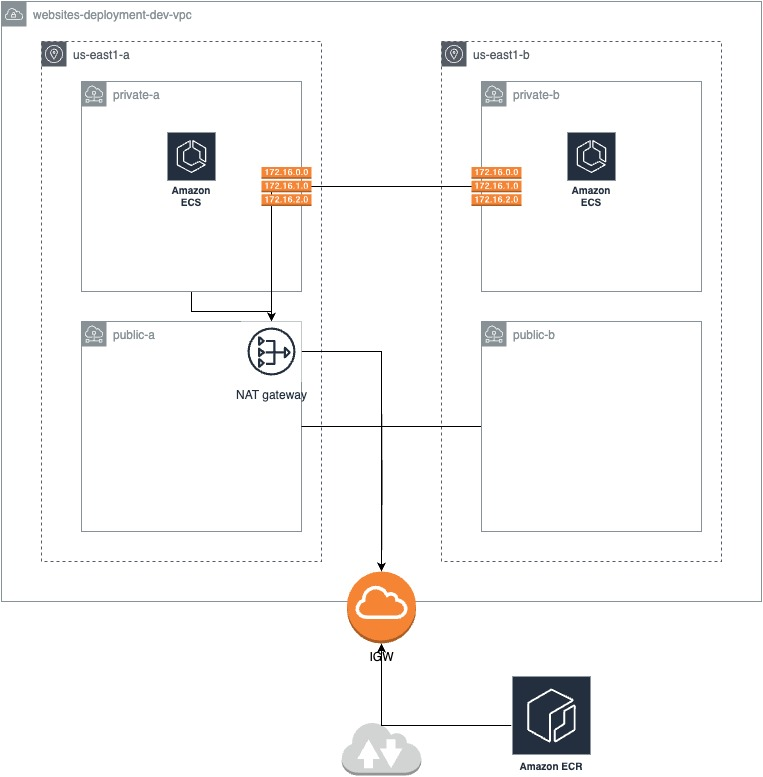
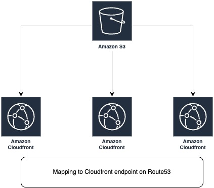

# Websites Deployment Project

AWS provides several ways for deploying a webapp or website. From ready and simple point and click solutions like [AWS Lightsail](https://aws.amazon.com/lightsail/) to complex solutions using clusters and several resources like .

This project manages the infrastructure and deployment of dynamic and static websites using [AWS ECS (Elastic Container Service)](https://aws.amazon.com/ecs/) and static S3 bucket storage, respectively. Both approaches are designed to work with separate development and production environments.

The domain `learningfor.fun` was registered to be used as the main domain here, and the end result will be the following:
- Static site deployed under the subdomain `static-[enviroment].learningfor.fun`
- Dynamic site deployed under the subdomain `dynamic-[environment].learningfor.fun`

### Infrastructure Overview

The project uses the following AWS services and components:

#### Dynamic Website Infrastructure (ECS)
- **VPC**: Isolated network with public and private subnets
- **ECS Cluster**: Manages containerized applications
- **Application Load Balancer**: Routes traffic to containers
- **ECR Repository**: Stores Docker images
- **CloudWatch**: Monitoring and logging
- **Route53**: DNS management with subdomains

### Infrastructure Diagram for ECS deployment


#### Static Website Infrastructure (S3)
- **S3 Bucket**: Hosts static website files
- **CloudFront**: Content delivery network for global distribution
- **ACM Certificate**: SSL/TLS for secure connections
- **Route53**: DNS management with subdomains

### Infrastructure Diagram for S3 static site deployment



## Project Structure
```
├── infra/
│   ├── modules/                      # Shared Terraform modules
│   │   ├── vpc/                      # VPC network configuration
│   │   │   ├── main.tf
│   │   │   ├── variables.tf
│   │   │   └── outputs.tf
│   │   │
│   │   ├── ecr/                      # Container registry
│   │   │   ├── main.tf
│   │   │   ├── variables.tf
│   │   │   └── outputs.tf
│   │   │
│   │   ├── ecs/                      # ECS cluster and service
│   │   │   ├── main.tf
│   │   │   ├── variables.tf
│   │   │   └── outputs.tf
│   │   │
│   │   ├── dns-subdomain/            # DNS configuration
│   │   │   ├── main.tf
│   │   │   ├── variables.tf
│   │   │   └── outputs.tf
│   │   │
│   │   ├── s3/                       # S3 bucket configuration
│   │   │   ├── main.tf
│   │   │   ├── variables.tf
│   │   │   └── outputs.tf
│   │   │
│   │   └── cloudfront/               # CDN configuration
│   │       ├── main.tf
│   │       ├── variables.tf
│   │       └── outputs.tf
│   │
│   ├── 00-dns-zone/                  # Base main domain DNS zone and SSL certificate setup
│   │   ├── main.tf                   
│   │   ├── variables.tf
│   │   └── outputs.tf
│   │
│   ├── 01-ecs-dynamic-site/          # ECS-based dynamic website
│   │   ├── environments/
│   │   │   ├── dev/                  # Development environment
│   │   │   │   ├── main.tf
│   │   │   │   ├── variables.tf
│   │   │   │   └── terraform.tfvars
│   │   │   │
│   │   │   └── prod/                 # Production environment
│   │   │       ├── main.tf
│   │   │       ├── variables.tf
│   │   │       └── terraform.tfvars
│   │
│   └── 02-static-site-s3/            # S3-based static website
│       ├── environments/
│       │   ├── dev/                  # Development environment
│       │   │   ├── main.tf
│       │   │   ├── variables.tf
│       │   │   └── terraform.tfvars
│       │   │
│       │   └── prod/                 # Production environment
│       │       ├── main.tf
│       │       ├── variables.tf
│       │       └── terraform.tfvars
│
├── sites/
│   ├── dynamic-site/                 # Dynamic application
│   │   ├── src/
│   │   ├── Dockerfile
│   │   ├── package.json
│   │   └── README.md
│   │
│   └── static-site/                  # Static HTML/CSS/JS website
│       ├── public/
│       ├── index.html
│       └── README.md
└── README.md                         # Project documentation
```

## Prerequisites

- AWS CLI (v2) - https://docs.aws.amazon.com/cli/latest/userguide/getting-started-install.html
- Terraform (v1.11) - https://developer.hashicorp.com/terraform/downloads
- Docker installed locally - https://docs.docker.com/get-docker/
- Node.js and npm (for the application) - https://nodejs.org/en/download/

## Deploy using local Terraform CLI

To run this project locally, follow these steps:

1. **Set up the DNS Zone first**:
   - Navigate to the DNS zone directory:
     ```
     cd infra/00-dns-zone
     ```
   - Adjust the domain name in this directory only, as this is the main zone. You can use the `terraform.tfvars` for that.
   - Initialize Terraform:
     ```
     terraform init
     ```
   - Apply the Terraform configuration:
     ```
     terraform apply
     ```
   - This step is mandatory before deploying any other components

2. **Deploy either the Static or Dynamic site**:
   - Choose which site type you want to deploy:
     - For the ECS-based dynamic site: `cd infra/01-ecs-dynamic-site/environments/[dev|prod]`
     - For the S3-based static site: `cd infra/02-static-site-s3/environments/[dev|prod]`

3. **Customize your deployment**:
   - Review and modify the `terraform.tfvars` file in your chosen environment directory
   - The domain name should match what you configured in the DNS zone
   - Adjust other variables like `subdomain` and environment-specific settings as needed

4. **Deploy with custom variables**:
   - Initialize Terraform in the chosen directory:
     ```
     terraform init
     ```
   - Apply the configuration with your custom variables:
     ```
     terraform apply -var-file=terraform.tfvars
     ```

5. **Verify your deployment**:
   - After successful deployment, check the outputs for URLs and other important information
   - For static sites, you can access your website at the subdomain you configured
   - For dynamic sites, the application will be available at your configured subdomain


## GitHub Actions Workflows

This project utilizes GitHub Actions to automate the deployment of both dynamic and static sites to AWS. There are two primary workflows defined in the `.github/workflows` directory:

1. **Deploy Dynamic Site Infrastructure** (`deploy-dynamic-terraform.yml`):
   - This workflow is triggered on pushes to the `main` and `dev` branches, specifically for changes in the `infra/01-ecs-dynamic-site` directory.
   - It sets up the necessary AWS credentials and Terraform environment, then deploys the ECS-based dynamic site to the respective environments (development or production) based on the branch being pushed.

2. **Deploy Static Site Infrastructure** (`deploy-static-terraform.yml`):
   - Similar to the dynamic site workflow, this one is triggered on pushes to the `main` and `dev` branches, but it focuses on the `infra/02-static-site-s3` directory.
   - It also configures AWS credentials and Terraform, deploying the S3-based static site to the appropriate environment.


## Improvements

- Create tests for Terraform files with TFTest - https://developer.hashicorp.com/terraform/language/tests
- Improve pipelines with test and security checks on the application builds.
- Make use of OIDC for wiring GitHub and AWS account to improve security
- Improve the terraform deployment process with a tool like [runatlantis.io](https://runatlantis.io) for better management of the infra code.